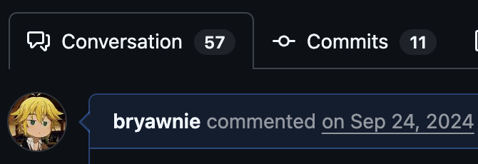
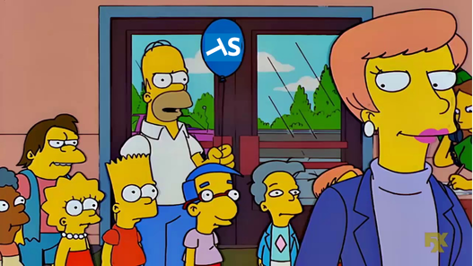

## Introducción

A lo largo de mis años estudiando ingeniería, uno de mis ramos favoritos fue "Lenguajes de Programación". Ese curso era como una introducción bastante completa a las bases de cualquier lenguaje: no solo nos enseñaba cómo se construyen las cosas, sino también qué semánticas hay detrás, cómo se implementan y qué implicancias tienen en la práctica. Para mí, fue la primera vez que me topé con la programación funcional: una forma de programar más matemática, más limpia y, al menos en mi cabeza, más "pura".

La idea general, en términos muy simples, es esta:

- **Funciones puras**: no tienen efectos secundarios como mutar variables externas o escribir en el sistema de archivos.
- **Funciones de primera clase**: las funciones pueden tratarse como valores; por ejemplo, una función puede recibir otra función como parámetro o devolverla.
- **Transparencia referencial e inmutabilidad**: el estado de una variable no cambia de forma arbitraria, así que en muchos casos puedes pensar en el código de forma más predecible.

No quiero hacer una definición ultraprecisa ni mucho menos, pero esa fue la sensación que me dejó al principio: algo más ordenado, más declarativo y, en cierto modo, más elegante.

Con el tiempo empecé a adoptar más este paradigma. Eso significó usar cosas como `map` y `reduce` en vez de `while` y `for`, aprovechar funciones `lambda` y empezar a pensar menos en "cómo hacer algo" y más en "qué quiero expresar". En parte por comodidad, en parte porque el código se veía más limpio y, claro, también porque me hacía sentir un poquito más cool.

> Para dejar un ejemplo simple, así se ve la versión imperativa de armar una lista `LOut` a partir de aplicar una función `foo` a cada elemento de `LIn`:
>
> ```py
> LOut = []
> for x in LIn:
>     y = foo(x)
>     LOut.append(y)
> ```
>
> Y así luce la versión funcional (ejemplo algo tramposo porque map de Python devuelve un iterador).
>
> ```py
> LOut = list(map(foo, LIn))
> ```

### Inicios con FP-TS

Cuando postulé para trabajar en Bemmbo (ahora Buk Finanzas), Ismael, uno de los desarrolladores de la startup, me dijo que dentro del stack usaban una librería llamada FP-TS. Lo dijo casi como si estuviera diciendo "esto te va a gustar", y en realidad tenía bastante razón.

> _Yo conocía a Ismael de la universidad, fuimos ayudantes de un ramo y a ambos nos gustaba la volá' teórica._

Al principio no me convenció del todo. Vi un tutorial de YouTube ([disponible aquí](https://www.youtube.com/watch?v=WsKEIFirdVc&list=PLUMXrUa_EuePN94nJ2hAui5nWDj8RO3lH)) donde explicaban lo básico: `pipe`, `flow`, `Option`, `Either`, `IO` y un montón de "modismos" que, si bien tenían sentido, se sentían como una capa extra sobre TypeScript. Mi primera impresión fue más o menos que "estamos metiendo wrappers innecesarios". Tenía que pensar primero cómo resolver una funcionalidad en TypeScript _vanilla_ y después darle otra vuelta para expresarla con la jerga de FP-TS. Eso me hizo ir muy lento al comienzo, y en mis primeras pull requests recibí bastante feedback.



### Interiorizando la idea

Uno de los puntos que más me llamó la atención de la programación funcional es que te hace pasar de enfocarte en el cómo al qué. En vez de escribir bucles detallados diciéndole al computador paso a paso qué hacer, empiezas a describir el flujo de forma más declarativa.

FP-TS me pareció bastante bueno en ese sentido. Te da un montón de primitivas que, una vez las dominas, hacen que el código sea más expresivo y más fácil de componer. Lo que más me gustó fue esto:

- Los errores se vuelven un valor más explícito, como `Left`/`Right`, en vez de depender tanto de `throw` y `try/catch`.
- La asincronía y los errores se pueden modelar con `Task` y `TaskEither`.
- Los efectos se pueden aislar mejor con `IO`.

Eso sí, también hay un lado menos glamoroso: al principio todo se siente más verboso y más abstracto. No es magia, y no siempre hace que el código sea más corto.

Para dar un ejemplo más concreto, esta idea de "validar algo, luego transformarlo y luego enviarlo" se vuelve bastante natural con `pipe`. Por ejemplo:

> Quiero que este _record_ se extienda en una lista en base a sus parametros, luego quiero usar cada valor de esa lista para armar un payload, y enviar multiples _requests_ en paralelo a una API externa.

Luce mas o menos así:

```ts
const result = await pipe(
  initialValue,
  R.collect(S.Ord)(retrieveProperty),
  A.map(buildPayload),
  A.map(sendPayload),
  A.sequence(TE.ApplicativePar),
)();
```

Con el tiempo, la cosa cambió bastante. Me pasó algo similar a cuando uno aprende un nuevo idioma: al inicio uno expresa la idea en su lenguaje nativo y luego la traduce, mientras que en la fase más madura uno expresa directamente la idea en el lenguaje final. Aquí fue algo parecido, ya no pensaba "cómo haría esto en TypeScript normal" y después "cómo lo traduzco a FP-TS". Empezaba a pensar directamente en flujos, composiciones y `pipe`s. No sé si eso es una señal de que me volví mejor programando, pero sí de que el modo de pensar había cambiado.

### Adopción de FP-TS

He tenido la oportunidad de trabajar en un _codebase_ bastante grande, y ahí fue donde el tema se volvió más interesante. Había features implementadas hace tres años, cuando el equipo recién estaba empezando a adoptar fp-ts, y otras implementadas literalmente ayer. La diferencia era abismal.

El código más viejo me recordaba a mis primeros pasos con la librería: intentos de usar sus utilidades de forma forzada, con wrappers de `Either` que al final terminaban haciendo un `throw`, y muchas soluciones que intentaban "hacerlo parecer" funcional sin terminar de aprovechar lo bueno de la herramienta. En cambio, el código más nuevo se veía mucho más robusto, más legible y más estructurado.

Y aquí viene algo que me parece importante: no era solo cuestión de tener mejor o peor código. El equipo también empezó a desarrollar una especie de identidad propia en torno a las convenciones. Había reglas más claras sobre cómo escribir cosas, qué cosas se promovían y qué cosas no. Eso hizo que el codebase se sintiera mucho más consistente.

Eso sí, también me parece justo decir que fp-ts no es algo fácil de adoptar. Incluso para gente con bastante experiencia, el cambio de mentalidad cuesta. Y si eso es así, entonces no es raro que para un junior el onboarding sea un poco más duro. En ese sentido, quizá sí estabamos creando una barrera de entrada más y más alta con el tiempo.

### Caída y fin de FP-TS (dentro del equipo)

Y acá viene la parte más curiosa: si era tan bueno, ¿por qué se murió?



Bueno, no se "murió" del todo, pero sí perdió fuerza. Por varios motivos:

1. Adoptar esta forma de programar requiere tiempo. Y en un entorno donde se necesitan sacar features rápido, ese tiempo no siempre está.
2. La librería `fp-ts` dejó de tener mantenimiento continuo hace bastante, y su sucesora, EffectTS, tiene una barrera de entrada aún mayor. Dentro del equipo no parecía valer la pena meterla al stack.
3. Como `fp-ts` no es tan masificado, los agentes de IA también se complican cuando tienen que explorar el código. Muchas veces se equivocan inventando funciones que no existen o que no encajan con la forma en que el equipo estaba trabajando.

Todo eso hizo que se dejara de impulsar tanto su uso, y el equipo terminó moviéndose más hacia estándares de TypeScript vanilla.

Eso no significa que todo lo que aprendimos con fp-ts se haya perdido. De hecho, creo que algunas cosas sí se quedaron para siempre: pensar más en abstracciones, escribir de forma más declarativa y estar más cómodo con ideas como pattern matching y currificación. Y aunque ya no impulsemos el uso de la librería en las nuevas implementaciones, sigue habiendo valor en esos conceptos.

### Conclusiones finales

¿Extraño usar fp-ts? Creo que sí, el cambio igual fue reciente. Llegó un punto en que casi todo lo que implementaba lo pensaba como una serie de pasos conectados con un `pipe`, y eso me gustó mucho. Pero también creo que es importante ser honesto con los límites: no es una solución universal, y no todo proyecto necesita ese nivel de abstracción.

Lo que sí me llevo de esa experiencia es que, más allá de la herramienta, me quedó una forma distinta de pensar el código. Y eso, al menos para mí, vale mucho.

Gracias por leer :D
